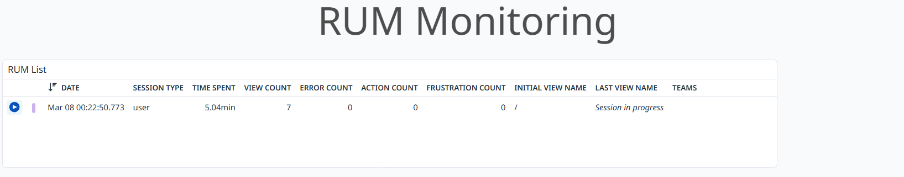
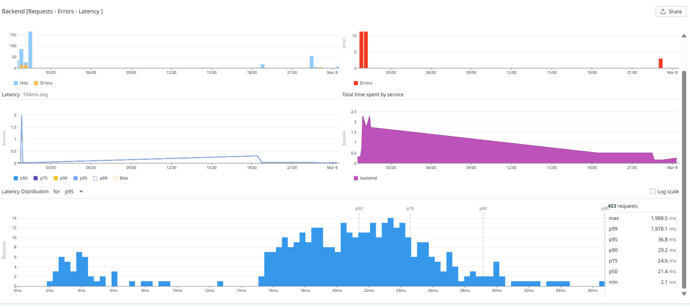
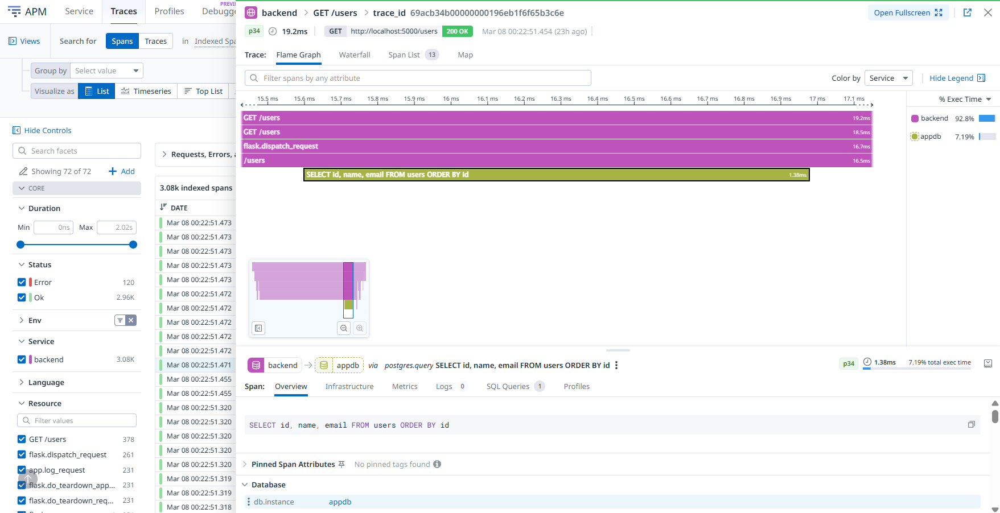
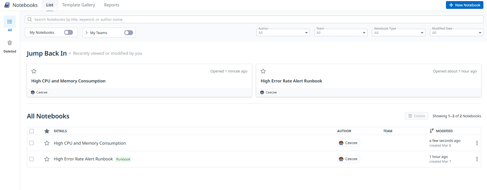

# 🐳 Fullstack Observability Stack

A containerized full-stack CRUD application with end-to-end observability — structured log streaming, APM tracing, RUM (Real User Monitoring), operational dashboards, monitors, and SLOs via Datadog.

> Built by a Technical Support Engineer with 8+ years in production systems to demonstrate real-world Docker and observability skills across the full stack: browser → backend → database.

---

## 🧱 Architecture

```
┌──────────────────────────────────────────────────────────┐
│                      Docker Network                       │
│                                                           │
│  ┌──────────────────┐     ┌──────────────────────────┐   │
│  │    Frontend       │────▶│    Backend (Python)      │   │
│  │  HTML/JS/CSS      │     │  Flask + Gunicorn        │   │
│  │  Datadog RUM SDK  │     │  ddtrace instrumented    │   │
│  └──────────────────┘     └────────────┬─────────────┘   │
│                                        │                  │
│                             ┌──────────▼──────────┐      │
│                             │    PostgreSQL DB      │      │
│                             │    postgres:15        │      │
│                             └──────────────────────┘      │
│                                                           │
│  ┌─────────────────────────────────────────────────────┐  │
│  │              Datadog Agent (sidecar)                 │  │
│  │   Logs · APM Traces · RUM · Infra Metrics           │  │
│  └─────────────────────────────────────────────────────┘  │
└──────────────────────────────────────────────────────────┘
```

### Services

| Service | Technology | Purpose |
|---|---|---|
| `frontend` | HTML / JavaScript / CSS + Nginx | CRUD UI, Datadog RUM instrumented |
| `backend` | Python / Flask / Gunicorn | REST API, ddtrace APM instrumented |
| `db` | PostgreSQL 15 | Persistent data storage |
| `datadog` | Datadog Agent (sidecar) | Log collection, APM, RUM, infra metrics |

---

## 🎯 What This Project Demonstrates

- **Docker Compose** orchestration of a 4-service stack with health checks and service dependencies
- **Inter-container networking** — frontend → backend → DB with proper DNS resolution
- **APM instrumentation** — `ddtrace-run gunicorn` capturing distributed traces with flame graphs
- **Structured JSON logging** — custom `JSONFormatter` across backend and Gunicorn, log levels correctly parsed by Datadog
- **RUM (Real User Monitoring)** — Datadog Browser SDK tracking page loads, JS errors, user sessions and Core Web Vitals
- **Log + Trace correlation** — trace IDs injected into log lines, connecting logs directly to APM spans
- **RED method dashboard** — Requests, Errors, Duration per service for incident-first observability
- **Monitors** — alerting on error rate, memory saturation, and CPU spikes
- **SLO tracking** — API availability SLO based on monitor uptime
- **Secrets management** — API keys externalized via `.env`, never hardcoded

---

## 📊 Datadog Observability Setup

### Logs
- All services emit structured JSON logs via Docker label autodiscovery
- Logs tagged by `service`, `env`, `container_name`
- Custom `JSONFormatter` on backend and Gunicorn — correct INFO/WARN/ERROR level parsing
- Nginx startup noise filtered via `exclude_at_match` log processing rules
- Log collection configured per service via `com.datadoghq.ad.logs` container labels

### APM
- Backend instrumented with `ddtrace-run` wrapping Gunicorn
- `patch_all()` auto-instruments Flask, psycopg2, and all DB queries
- Trace IDs injected into JSON log lines — click a log to jump to its APM flame graph
- Service map shows `backend → appdb (PostgreSQL)` dependency auto-detected

### RUM (Real User Monitoring)
- Datadog Browser SDK (JS) integrated into frontend
- Captures page load times, JS errors, user sessions, Core Web Vitals (LCP, FID, CLS)
- Connects frontend user actions to backend APM traces end-to-end

### Dashboard — "Fullstack Service Health"
- Service Health Table: Requests / Errors / P95 Latency per service (RED method)
- Backend vs DB Latency Breakdown — isolates application vs database response time
- Backend Request Latency Percentiles — P50, P75, P90, P95
- CPU and memory consumption per container
- Live backend log stream
- Service Map widget — backend → appdb topology
- RUM widgets: JS error count, active sessions, Core Web Vitals

### Monitors
- **[Backend] High Error Rate** — alerts when error count exceeds threshold in 5 minutes
- **[Infra] High Memory Consumption** — alerts on memory saturation per container
- **[Infra] High CPU Load** — alerts on CPU spike per service

### SLO
- **API Availability SLO** — tracks backend service availability based on monitor uptime
- Target: 99% over 7-day rolling window

---

## 🚀 Getting Started

### Prerequisites
- Docker + Docker Compose installed
- Datadog account (free trial works) with an API key from [app.datadoghq.eu](https://app.datadoghq.eu)
- Datadog agent installed on your host machine ([install guide](https://docs.datadoghq.com/agent/))

### 1. Clone the repo

```bash
git clone https://github.com/ramya-rmkrsh/fullstack-observability-stack.git
cd fullstack-observability-stack
```

### 2. Configure environment variables

```bash
cp .env.example .env
```

Edit `.env` and add your Datadog API key:

```bash
DD_API_KEY=your_datadog_api_key_here
DD_SITE=datadoghq.eu
```

### 3. Configure the host Datadog agent

The containerized Datadog agent collects traces and logs from all services via Docker socket. For APM traces and logs to stream correctly, enable both in your **host** Datadog agent config:

```bash
sudo nano /etc/datadog-agent/datadog.yaml
```

Ensure these are set:

```yaml
logs_enabled: true

apm_config:
  enabled: true
```

Then restart the host agent:

```bash
sudo systemctl restart datadog-agent
```

> **Note:** Even though `DD_APM_ENABLED=true` and `DD_LOGS_ENABLED=true` are set as environment variables in `docker-compose.yml`, explicitly enabling them in `datadog.yaml` is required for traces and logs to reliably stream to Datadog — particularly for APM. This appears to be a known behaviour with certain agent versions when running in containerized environments.

### 4. Start the stack

```bash
docker-compose up --build
```

### 5. Open the app

```
Frontend:    http://localhost:8080
Backend API: http://localhost:5000
```

### 6. Verify Datadog agent is healthy

```bash
# Full agent status
docker exec datadog-agent-007 agent status

# Confirm APM traces are flowing
docker exec datadog-agent-007 agent status | grep -A10 "Receiver (previous"

# Confirm logs are being collected
docker exec datadog-agent-007 agent status | grep -A10 "Logs Agent"
```

---

## 🔧 Troubleshooting

### Frontend cannot reach the backend

If the UI loads but API calls fail, verify the frontend container can actually reach the backend:

```bash
# Check backend container is running
docker ps | grep backend

# Test backend reachability from inside the frontend container
docker exec <frontend_container_name> curl -v http://backend:5000/health

# Check backend logs for startup errors
docker logs <backend_container_name> --tail 50
```

### Backend cannot reach the database

If the backend starts but returns DB errors, test connectivity from inside the container:

```bash
# Test DB port is reachable from backend container
docker exec <backend_container_name> nc -zv db 5432

# Check PostgreSQL is healthy and accepting connections
docker exec postgres-db pg_isready -U appuser -d appdb

# Check DB logs for errors
docker logs postgres-db --tail 50
```

### APM traces not appearing in Datadog

```bash
# Confirm the agent is accepting traces
docker exec datadog-agent-007 agent status | grep -A10 "Receiver"

# Confirm DD environment variables are set correctly in the backend
docker exec <backend_container_name> env | grep DD

# Verify datadog.yaml on host has APM enabled
grep -A3 "apm_config" /etc/datadog-agent/datadog.yaml
```

If traces are still not flowing, restart the host agent and the stack:

```bash
sudo systemctl restart datadog-agent
docker-compose down && docker-compose up --build
```

### Logs not streaming to Datadog

```bash
# Confirm log collection is active in the agent
docker exec datadog-agent-007 agent status | grep -A10 "Logs Agent"

# Verify container labels are being picked up by the agent
docker inspect <backend_container_name> | grep -A5 "com.datadoghq"

# Check datadog.yaml on host has logs enabled
grep "logs_enabled" /etc/datadog-agent/datadog.yaml
```

### A container is not starting

```bash
# Check status of all containers
docker-compose ps

# See why a specific container exited
docker logs <container_name> --tail 100

# Full reset — remove containers and volumes, rebuild from scratch
docker-compose down -v
docker-compose up --build
```

---

## 📁 Project Structure

```
fullstack-observability-stack/
├── backend/
│   ├── app.py                  # Flask API — ddtrace, JSONFormatter, trace ID injection
│   ├── gunicorn_config.py      # Gunicorn JSON log formatter
│   ├── requirements.txt
│   └── Dockerfile
├── frontend/
│   ├── index.html              # Datadog RUM Browser SDK integrated
│   ├── app.js                  # CRUD operations with frontend structured logging
│   └── styles.css
├── screenshots/                # Datadog dashboard, APM, RUM, monitor screenshots
├── datadog/
│   └── dashboard.json          # Exportable Datadog dashboard — import into your own account
├── docker-compose.yml
├── .env.example
└── README.md
```

---

## 🔍 Key Technical Decisions

**Why `ddtrace-run gunicorn` instead of running Flask directly?**
Gunicorn is the production WSGI server — running Flask's built-in server wouldn't reflect real-world usage. Wrapping with `ddtrace-run` instruments every request at the process level before it hits Flask.

**Why a custom `JSONFormatter` instead of plain text logs?**
Datadog parses structured JSON to extract log levels, trace IDs, and service tags automatically. Plain text logs arrive as raw strings with no level metadata — causing everything to show as ERROR by default.

**Why inject trace IDs into logs?**
During an incident, clicking a log line jumps directly to the APM flame graph for that exact request — no manual correlation. This is standard practice in production observability.

**Why a sidecar Datadog agent instead of host-level install?**
Keeps the entire observability stack portable and self-contained. The agent discovers services automatically via Docker socket and container labels — no per-service configuration needed beyond the labels in `docker-compose.yml`.

**Why configure both `docker-compose.yml` env vars AND `datadog.yaml`?**
Environment variables handle runtime configuration for each service. However, the host agent's `datadog.yaml` controls whether the agent process itself has APM intake and log collection enabled at startup — without this, traces may not flow regardless of what the compose file specifies.

**Why separate Backend Latency vs DB Latency in the dashboard?**
During incidents, knowing whether slowness is in the application layer or database layer determines which team to page and what to investigate first. Separating these signals reduces mean time to diagnosis.

---

## 📸 Observability Screenshots

### Full Stack Dashboard





### Service Map (backend → appdb)


### APM Trace Flame Graph


### RUM — Frontend Monitoring


### Monitors


### Runbooks


---

## 📌 What I'd Add Next

- [ ] PostgreSQL slow query log collection and Datadog postgres integration metrics
- [ ] GitHub Actions CI/CD — build and validate containers on every push
- [ ] Datadog Synthetic tests — automated UI and API uptime checks on a schedule
- [ ] SLO based on error budget burn rate (count-based) once traffic volume is sufficient
- [ ] Integrate with the [Incident Triage Engine](https://github.com/ramya-rmkrsh/incident-triage) — auto-classify Datadog alert payloads by severity

---

## 🛠 Tech Stack

`Docker` · `Docker Compose` · `Python` · `Flask` · `Gunicorn` · `PostgreSQL` · `Nginx` · `HTML/JS/CSS` · `Datadog APM` · `Datadog Logs` · `Datadog RUM` · `Datadog Monitors` · `Datadog SLO` · `ddtrace`

---

## 👤 Author

**ramya-rmkrsh** — Technical Support Engineer with 8+ years in production systems.

[GitHub Profile](https://github.com/ramya-rmkrsh)
